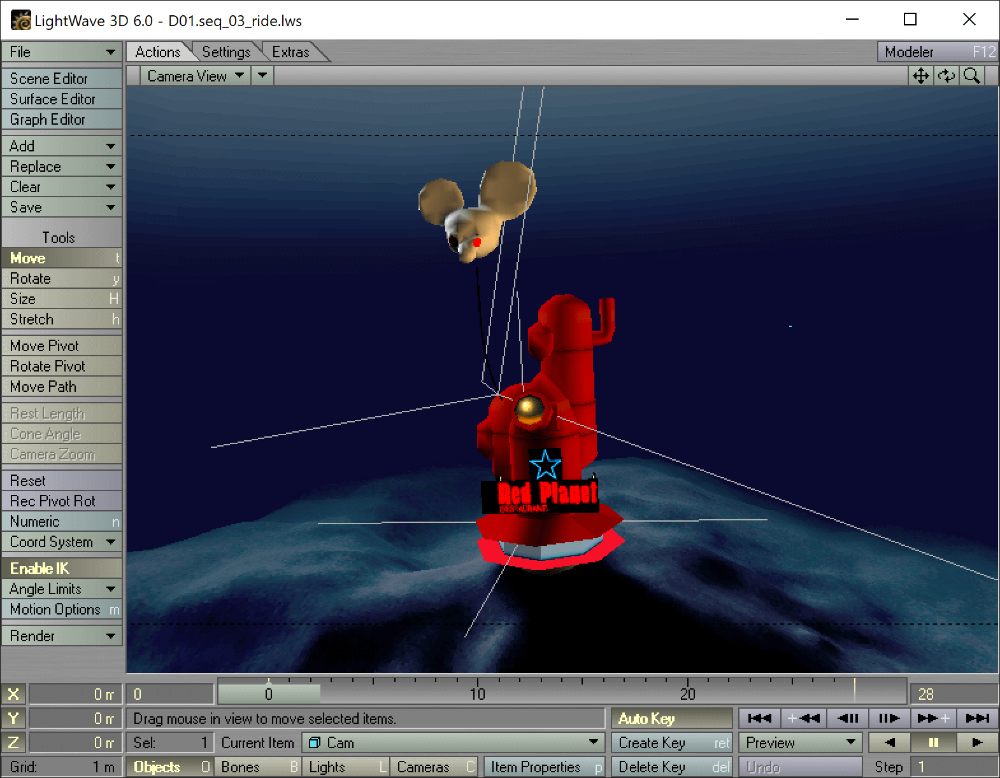

# Red Line
3D and 2D assets of the demoscene production, [Red Line](https://www.pouet.net/prod.php?which=9110). The demo original ran on the [JFYE](https://www.pouet.net/prod.php?which=13418) 3D engine.



## Overview

2D and 3D assets :
* 3D assets are a series of Lightwave files
* 2D assets are a series of bitmaps

[Youtube video here](https://www.youtube.com/watch?v=acs9M275ECY)

## Credits

- Norecess, Jylam: code
- Mikl: 2D
- Fra, med: 3D
- RedRibbon, med: music

## NFO file

```
                     ____          ______
                   _/   /___  _____|    |________
                   \   ____/__|   _|    \_   ___/___
     +--------------\  \/     /   \.    |/  __/    /------------------+
     | ::::::::::::. \_______/|____|    |\________/    .::::::::::::: |
 ____|_____________`:.            _|    |___      .:::::'  _________ :|
 \ .............  / `::::::::::' /__ \_\    \ `::::' ______|       /  |
  \_    _________/____      _____\\/ /__\    \  _____\     |      /___|_
   /   __>____/       \_____|    _\\/_   \    \/      \  \ | /   /  __  \____
   \   \      \  _\    \    |   /     \ \ \    \  /_   \  \./   /   \___/   /
    \   \     \\ \/   \/    |   \     /  \ \   \\ \/   /  / \   \          /
  ===\        //___:   \\_______/\___/\___\    //____ /____|     \____ ___/===
     |\_______/    l___/ .....          ___\___/___    ____|______/bLa|
     |  .   __\__     / ______`. ______/  /__ \    \  /    /    ...   |
     | `    |   /    /__\__  /___\_   \_  __/__\    \/    /    :'`::  |
     |  ====|   \___/   __   \|  _/   /_\  \/   \____\   /====   .:'  |
     |   .  |   |   \_________\__\     / \_____/   /    /      .::'   |
     |  :.  |___|  .              \___/           /____/      .:'     ¦
     |  `:........:`:::::::::::::........::::::::...........::`       |
     |    ¨¨¨¨¨¨¨                 ¨¨¨¨¨¨         ¨¨¨¨¨¨¨¨¨¨
     +------------------------------------------------------------- -

                          EQUiNOXE PARTY 2oo3
                     http://equinoxe.m4nkind.com
                 
                        20 - 21 - 22 mars 2oo3

                La cité des Sciences - iNSiDE PARiS

         		      EDiTiON #1
         -  -- ------------------------------------------- --  - 
  
           Name of competitor(s) : Norecess, Jylam, Mikl, Fra
                                   med, RedRibbon

           Name of group(s) : Condense&Mandarine

           Name of entry : Red Line

           Competition : DEMO

         -  -- ------------------------------------------- --  - 
```
